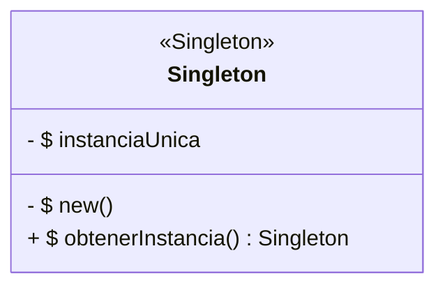
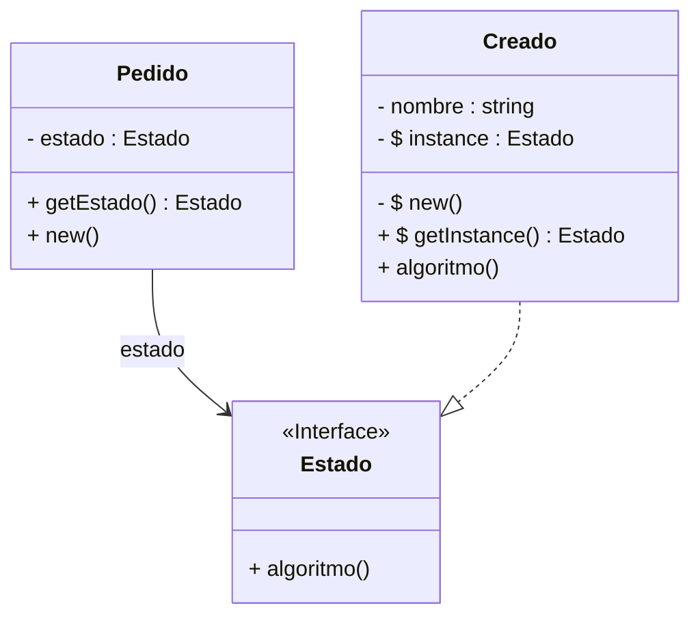

# Implementación del Patrón Singleton

## Singleton Diagram Class 

## Índice

## 1. Introducción  

---

## 2. Dominio de Aplicación

---

## 3. Diseño del Sistema

---

## 4. Marco Teórico

---

## 5. Estilo Arquitectónico

Se adopta una implementación acotada del estilo arquitectónico **Layered** (arquitectura en capas).

### Estructura aplicada:
Se define un único directorio:

- **Models**: contiene el dominio del negocio, incluyendo clases, métodos y atributos.

No se implementa persistencia, todas las operaciones se realizan en memoria.  
La ejecución del sistema se realiza desde la clase principal `App`.

---

## 6. Diagrama de clases

---

## 7. Desarrollo de la Implementación

### 7.1 App.java

- Se Crea un objeto de tipo pedido
- Se muestra el estado actual del pedido creado

### 7.2 Pedido.java
- Se define un atributo estado de tipo "Estado"(interface).
- Se define el constructor el cual asigna al atributo "estado" el objeto "Creado", el cual en caso de no existir se crea, caso contrario solo se asigna puntero al mismo.
- Se define un getter para el atributo en cuestion.

### 7.3 Estado.java
- Se define una interfaz de tipo "Estado" 
- Se define la firma del metodo "algoritmo"

### 7.4 Creado.java
- Se implementa la interfaz "Estado" en la clase "Creado"
- Se define el atributo estático privado "instance" (Sera el contenedor de la unica instancia existente de esta clase)
- Se define el constructor de manera privada
- Se define el método "getInstance()" que realiza lo siguiente:
    - Verifica si existe una instancia de esta clase
        - En caso de no existir la crea, asignandola al atributo "instance"
    - Luego retorna la instancia del objeto "Creado" contenido en el atributo "instance"
- Se redefine el método polimorfico "algoritmo" implementado (Ver [State](../State/README.md))

---

## 8. Conclusión
El uso del patron Singléton permite mantener una sola instancia de una clase.

---

## 9. Consideraciones Finales

El patrón Singleton es la solución arquitectónica ideal cuando necesitamos garantizar unicidad y acceso global.
Ejemplos de aplicacion:

A. Estados (Optimización del Patrón State)

B. Puntos de Acceso (Servicios y Recursos)

C. Categorías (Tipos, Estrategias y Constantes con Lógica)

