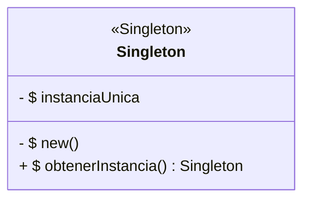
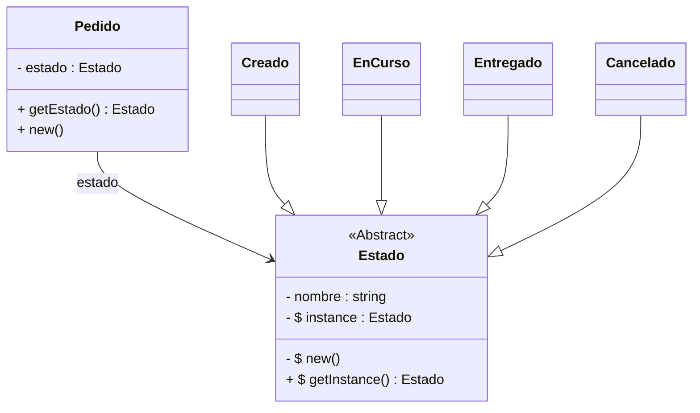
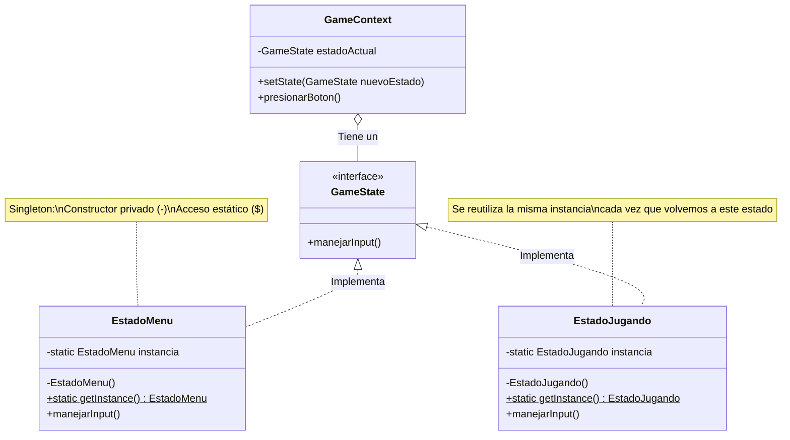

# Implementación del Patrón Strategy

## Strategy Diagram Class 

## Índice

## 1. Introducción  

---

## 2. Dominio de Aplicación

---

## 3. Diseño del Sistema

---

## 4. Marco Teórico

---

## 5. Estilo Arquitectónico

Se adopta una implementación acotada del estilo arquitectónico **Layered** (arquitectura en capas).

### Estructura aplicada:
Se define un único directorio:

- **Models**: contiene el dominio del negocio, incluyendo clases, métodos y atributos.

No se implementa persistencia, todas las operaciones se realizan en memoria.  
La ejecución del sistema se realiza desde la clase principal `App`.

---

## 6. Diagrama de clases

---

## 7. Desarrollo de la Implementación

### 7.1 App.java

### 7.5 SueldoTemporal.java

---

## 8. Conclusión

---

## 9. Consideraciones Finales
