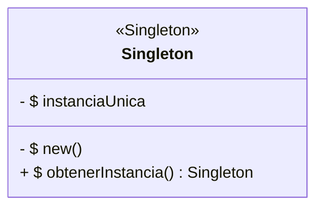
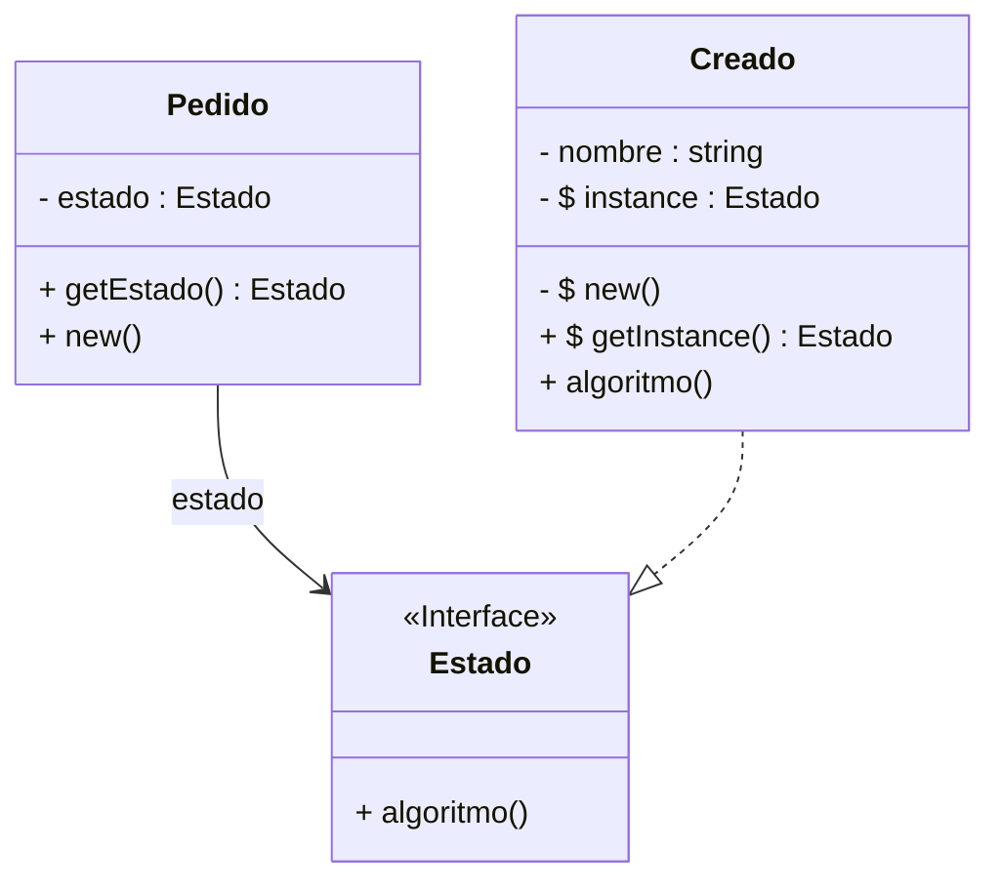

# Implementación del Patrón Singleton

## Singleton Diagram Class 

## Índice

- [1. Introduccion](#1-introduccion)
- [2. Dominio de Aplicacion](#2-dominio-de-aplicacion)
- [3. Diseno del Sistema](#3-diseno-del-sistema)
  - [3.1 Clase Contexto](#31-clase-contexto)
  - [3.2 Estados](#32-estados)
  - [3.3 Interfaz](#33-interfaz)
- [4. Marco Teorico](#4-marco-teorico)
- [5. Estilo Arquitectonico](#5-estilo-arquitectonico)
- [6. Diagrama de clases](#6-diagrama-de-clases)
- [7. Desarrollo de la Implementacion](#7-desarrollo-de-la-implementacion)
  - [7.1 App.java](#71-appjava)
  - [7.2 Pedido.java](#72-pedidojava)
  - [7.3 Estado.java](#73-estadojava)
  - [7.4 Creado.java](#74-creadojava)
- [8. Conclusion](#8-conclusion)
- [9. Consideraciones Finales](#9-consideraciones-finales)

---

## 1. Introduccion  
En este proyecto explicaremos la implementacion del patron singleton.

---

## 2. Dominio de Aplicacion
Se modelara un pedido junto a sus estados, cada estado tendra una instancia unica. Aplicando asi el patron Singleton.

---

## 3. Diseño del Sistema
### 3.1 Clase Contexto
- Pedido
### 3.2 Estados
- Creado

### 3.3 Interfaz
- Estado

---

## 4. Marco Teorico
El patrón de diseño Singleton garantiza que una clase tenga una única instancia en todo el sistema y proporciona un punto de acceso global a dicha instancia.

El objetivo principal del patrón Singleton es:
- Evitar la creación de múltiples instancias de una clase.
- Centralizar el acceso a un único objeto compartido.
- Mantener control sobre recursos críticos o compartidos.

---

## 5. Estilo Arquitectonico

Se adopta una implementación acotada del estilo arquitectónico **Layered** (arquitectura en capas).

### Estructura aplicada:
Se define un único directorio:

- **Models**: contiene el dominio del negocio, incluyendo clases, métodos y atributos.

No se implementa persistencia, todas las operaciones se realizan en memoria.  
La ejecución del sistema se realiza desde la clase principal `App`.

---

## 6. Diagrama de clases

---

## 7. Desarrollo de la Implementacion

### 7.1 App.java

- Se Crea un objeto de tipo pedido
- Se muestra el estado actual del pedido creado

### 7.2 Pedido.java
- Se define un atributo estado de tipo "Estado"(interface).
- Se define el constructor el cual asigna al atributo "estado" el objeto "Creado", el cual en caso de no existir se crea, caso contrario solo se asigna puntero al mismo.
- Se define un getter para el atributo en cuestion.

### 7.3 Estado.java
- Se define una interfaz de tipo "Estado" 
- Se define la firma del metodo "algoritmo"

### 7.4 Creado.java
- Se implementa la interfaz "Estado" en la clase "Creado"
- Se define el atributo estático privado "instance" (Sera el contenedor de la unica instancia existente de esta clase)
- Se define el constructor de manera privada
- Se define el método "getInstance()" que realiza lo siguiente:
    - Verifica si existe una instancia de esta clase
        - En caso de no existir la crea, asignandola al atributo "instance"
    - Luego retorna la instancia del objeto "Creado" contenido en el atributo "instance"
- Se redefine el método polimorfico "algoritmo" implementado (Ver [State](../State/README.md))

---

## 8. Conclusion
El uso del patron Singléton permite mantener una sola instancia de una clase. Sin embargo, no se debe de abusar del mismo ya que esto podria ocasionar en problemas de acoplamiento al ser clases de acceso global.

---

## 9. Consideraciones Finales

El patrón Singleton es la solución arquitectónica ideal cuando necesitamos garantizar unicidad y acceso global.
Ejemplos de aplicacion:

A. Estados (Optimización del Patrón State)

B. Puntos de Acceso (Servicios y Recursos)

C. Categorías (Tipos, Estrategias y Constantes con Lógica)

