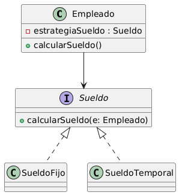

# Implementación del Patrón Strategy

## Índice

- [1. Introducción](#1-introducción)
- [2. Dominio de Aplicación](#2-dominio-de-aplicación)
- [3. Diseño del Sistema](#3-diseño-del-sistema)
  - [3.1 Clase Contexto](#31-clase-contexto)
  - [3.2 Estrategias](#32-estrategias)
  - [3.3 Interfaz](#33-interfaz)
- [4. Marco Teórico](#4-marco-teórico)
- [5. Estilo Arquitectónico](#5-estilo-arquitectónico)
- [6. Diagrama de clases](#6-diagrama-de-clases)
- [7. Desarrollo de la Implementación](#7-desarrollo-de-la-implementación)
  - [7.1 App.java](#71-appjava)
  - [7.2 Empleado.java](#72-empleadojava)
  - [7.3 Sueldo.java](#73-sueldojava)
  - [7.4 SueldoFijo.java](#74-sueldofijojava)
  - [7.5 SueldoTemporal.java](#75-sueldotemporaljava)
- [8. Conclusión](#8-conclusión)
- [9. Consideraciones Finales](#9-consideraciones-finales)

## 1. Introducción  
El presente trabajo tiene como objetivo demostrar la aplicación del patrón de diseño **Strategy** mediante un ejemplo práctico implementado en Java, dentro del contexto de una empresa de contabilidad. A través de este patrón se logra desacoplar el algoritmo de cálculo del sueldo del objeto que lo utiliza, permitiendo modificar el comportamiento dinámicamente en tiempo de ejecución.

---

## 2. Dominio de Aplicación
- Empresa de Contabilidad

---

## 3. Diseño del Sistema

### 3.1 Clase Contexto
- Empleado

### 3.2 Estrategias
- SueldoFijo  
- SueldoTemporal

### 3.3 Interfaz
- Sueldo

---

## 4. Marco Teórico

La estructura del patrón **Strategy** puede resultar similar al patrón **State**, pero existe una diferencia conceptual importante.  
En el patrón State, los estados particulares pueden conocerse entre sí e iniciar transiciones entre ellos. En cambio, en el patrón Strategy las estrategias son independientes entre sí y no mantienen relación directa.

---

## 5. Estilo Arquitectónico

Se adopta una implementación acotada del estilo arquitectónico **Layered** (arquitectura en capas).

### Estructura aplicada:
Se define un único directorio:

- **Models**: contiene el dominio del negocio, incluyendo clases, métodos y atributos.

No se implementa persistencia, todas las operaciones se realizan en memoria.  
La ejecución del sistema se realiza desde la clase principal `App`.

---

## 6. Diagrama de clases

---

## 7. Desarrollo de la Implementación

### 7.1 App.java
En esta clase se crean los empleados "Gaspar" y "Huenu".  
Al primero se le asigna una estrategia del tipo sueldo fijo con un monto de 20.000 pesos.  
Al invocar el método `gaspar.calcularSueldo()`, la clase `App` no conoce cómo se calcula el sueldo, sino que delega esta responsabilidad en la estrategia correspondiente.  
El segundo empleado utiliza otra estrategia, lo que genera un resultado diferente.

### 7.2 Empleado.java
Representa el empleado del sistema. Cuenta con un atributo llamado `estrategiaSueldo` del tipo `Sueldo`, que se define mediante el constructor.  
Dispone del método `calcularSueldo()` que delega el procesamiento a la estrategia seleccionada, pasando al propio empleado como parámetro.

### 7.3 Sueldo.java
Interfaz que define el contrato común para todas las estrategias de cálculo de sueldo.  
Incluye el método `calcularSueldo(Empleado e)`.

### 7.4 SueldoFijo.java
Implementa la interfaz `Sueldo`.  
Su cálculo se basa en parámetros como el tiempo trabajado, una cotización fija y descuentos aplicados.  
El cálculo toma en cuenta además el monto definido al instanciar el empleado.

### 7.5 SueldoTemporal.java
Implementa la interfaz `Sueldo`.  
Posee una lógica de cálculo diferente adaptada a empleados temporales.

---

## 8. Conclusión

El uso del patrón Strategy permite desacoplar el comportamiento del cálculo del sueldo del objeto `Empleado`, logrando una arquitectura flexible y extensible.  
La incorporación de nuevos tipos de estrategias no requiere modificar la clase `Empleado`, respetando el principio abierto/cerrado (OCP).

---

## 9. Consideraciones Finales

- La creación de empleados y la asignación de estrategias se realizan de forma fija para simplificar el ejemplo.
- En un escenario real, los datos serían recibidos desde un frontend.
- La validación del tipo de empleado debería determinar dinámicamente qué estrategia asignar.
